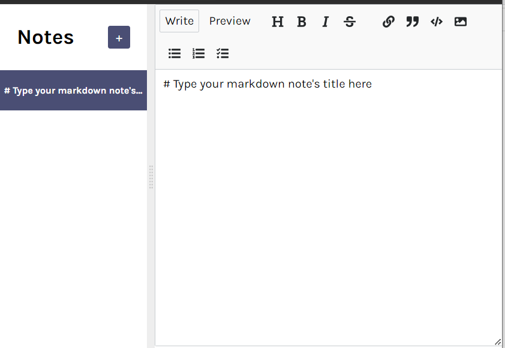

## Note Taking App :

1. This is a note taking App with built-in markdown feature.
 
2. It stores user's data in browsers's local storage.
 
3. It has lot of text styling options in-built which user can opt for by simply selecting them from the header tab.
 
4. It shuffles the recently used note always to the top.
 
 

<h3> Below is the quick tour of App : <h3>
 
1. Initial Page :
 
 

 
 

2. Create a Note :
 
 

 
 

3. Take Notes :
 
 

 
 

4. Add Styles :
 
 

 
 

5. Preview :
 
 

 
 

6. Delete a note :
 
 

 
 

7. After note delete :
 
 
